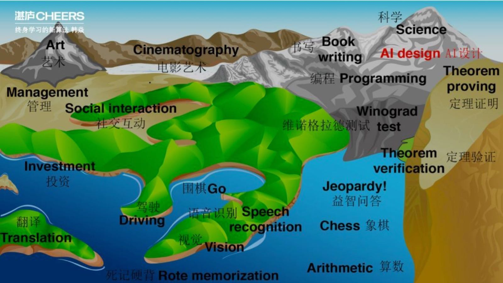
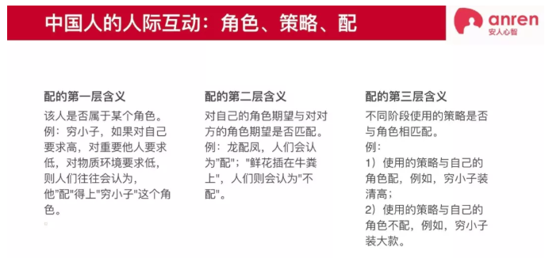

## 《杠杆与风险》学习笔记

[杠杆与风险](https://mp.weixin.qq.com/s/nTyjpilVlpAGJuhUeC58WA)

人生际遇发展，35岁是一个门槛。

### 1 人类存在的三维度
> 人有三种维度的存在：生物的；物理的；心灵的。第一种是生物学意义上的存在。第二种是物理学意义上的存在。第三种是心灵上的存在。

人类存在三个递增的维度：生物，物理和心灵。它们可以和马斯洛的需求层次做个简单对应关系。**生物维度**对应的是人类的生理需求，即Basic needs，包括Physiolgical needs 和safety needs，这是人类为了实现肉身的存在和种族的繁衍的基本要求，也深深的刻在每个当代人的潜意识里。同时也构成了所谓自主心智。**物理维度**，即人类在满足了基本的生理需求上，作为一个人类社会中的一份子所进行的一系列个体活动，即马斯洛需求层次的psychological needs 和部分self-fulfillment needs。**心灵维度**，我的理解是一部分极其优秀的人类先驱跨越了生理层面的基本需求，即生物维度和个人在现世的个体需求，即物理维度，对整个人类产生了跨时空的大周期影响，也即能产生优秀模因。对应马斯洛需求层次是一部分的self-fulfillment needs 和更上层的对于人类社会回馈的贡献和价值。

显然，现在社会的大部分人，都是处于**物理维度**，局限于个体当下的时空，产生一定的影响，满足自己的维度内不同层次的需求。同时，即贪恋或潜意识受制于自己的生物维度，又会偶尔受到心灵维度的感召和呼唤。然而，能突破当下时空限制、切换到心灵维度的人无论从个人能力、使命感、延迟满意控制能力的要求都是极高，注定只是极少数人的游戏。相对的，人们更容易受到下一层生物维度的诱惑，它的影响是无形的、潜意识层面的，得到的正面反馈又是即时的、当下可见的。
虽然古今中外，能达到心灵维度的圣贤寥若星辰、屈指可数，却是整个人类的启明星，航行的瞭望塔。而见贤思齐亦是人之常情，希望又总是美好的。人们希望从先贤身上发现普世的规律，能为己所用，迷茫困惑时可以解惑、百尺竿头希望更进一步时可以作为攀登的台阶。

于是，我们需要的答案就呼之欲出了，原来除了我们学不会的，他们与生俱来的天赋，还有我们可以尝试着去学习，或者至少有些许启发的，那就是**杠杆**的力量。圣贤皆是善用杠杆之人。

### 2 圣贤的密码：三种杠杆
> 人有三种存在，人亦有三种杠杆：时间的；他人的；个人的。

这三个杠杆，即hack自己的个人杠杆，hack别人的他人杠杆，及hack规则的时间杠杆。
而根据理解的难易程度，我们得倒过来论述。

首先是hack规则的**时间杠杆**。人终难逃一死，虽然历代永远不乏人们对于永生的孜孜不倦的追求，但是至少到目前为止，时间对于每个人都是有限刚性。那么，头等重要的当然就是如何利用好自己极其有限的时间，圣贤们也必然在这点上要大作文章。

> 一类人是小时工、快递员；一类人是绝大多数白领；最后一类人，比如企业家或畅销书作家，收入并非均匀分布，而是来自某个时间周期内的杰出成就。

我们姑且粗略把人分成三等，**第一类人是计件获取报酬的人**。他们从事没有任何杠杆效果、甚至是负利效应的工作，他们是小时工、快递员、搬运工、司机等。他们只是依赖于自己的生物特征的技能、或者并不能有累积效果的低端技能、甚至包括会终将被科技所替代的技能，用可接受的俗语，“吃的是青春饭”。可悲的是，随着科技的奇点的来临，更多的工种、更多的人会被包含进“吃青春饭”队伍。 

**第二类是所谓的新兴中产阶级**，也是大部分现在社会普通人通过自己的努力，在父母的殷切期望中一步步实现的自己的人生道路的“常规军”。他们是大城市里的白领们。他们学生阶段努力学习，毕业努力找个好工作，工作岗位上努力表现争取晋级，虽然当今社会企业的生命周期已经远远小于自己父辈们当年的厂矿企业的，他们骨子里依然无意识的期望能继续拥有“铁饭碗”，要么找个“靠谱的”大公司，要么期望通过不断“精进”自身的专业技能获得技能上的“铁饭碗”。也有更"高阶"的打法，做个所谓的“斜杠青年”，一专多能。然而，受制于上有老、下有小的压力，他们又不得不继续围绕着自己的主要角色——“现代化工业体系的一颗螺丝钉”来转。他们能做的只是，尽量使自己的表面涂上防护漆，尽量磨得锃亮。归根到底，他们的主要收入形式还是周薪、月薪，以及极少数的年薪。而期望能产生杠杆的因素掰着指头数一下，似乎也不能仰仗。**职称的提高？**且不说期望公司能够成为101年老店，在保证自身不因为年龄、家庭、身体缘故带来任何“恼人的干扰项”之外，通往晋升的道路如变形的金字塔，脚手架上爬满了努力向上的人。而上面仅存的几个位置又似乎摇摇欲坠，随时可以被风刮跑。**技能的提高？**首先最好是类似医生、律师那样越老越吃香的职业，而不是IT行业这样有着几年技术就会更新换代、清零重启的风险。其次，在当下科技发展的席卷下，能幸免于难的行业似乎也寥寥无几，而这些行业和领域，适合自己、能用上力去快速试错的更如大熊猫般稀缺。或者是来个斜杠青年，看见知识付费火，顺势把自己也包装一下圈个粉；看见区块链火，自己也投身买点比特币。不过，似乎最终也只能小打小闹，不成气候。假以时日，正规军起来了就只能溃散而去。试错成本相对成功的概率，还是惨淡了些。**那么来一把理财呢？**用自己辛辛苦苦积攒的压箱底的钱做点“投资”，你又很可能变成别人盘中的韭菜，正所谓“你盯着别人的利润，别人盯着你的本金。” 
**第三类人却是真正可以利用时间杠杆效应的**。他们可以、或者有资本忍受看似高风险、初期投入产出"性价比"很差的工作，却最终可以成功和时间做朋友，甚至驯服时间，在人生的大周期上实现躺赢。他们是企业家、畅销书作家、成功实现商业变现的发明家。 显然，圣贤们更是可以将时间杠杆用到极致，他们可以在短短的一生做出伟大的成就，福泽当世及后人。他们甚至可以不需要当世的回报，以博得名垂千古。

第二个是hack**他人的杠杆**。普罗大众的一个错误共识，是尽可能管理更多的人。这样，就要求自己爬到更高的位置，掌控更多的权利。大部分人的职业道路也是循着这样的思路去发展的。而少数另一类人，看上去似乎和前者相似，甚至在某些表象上会重叠。但是，骨子里，他们是想着如何尽量扩大自己的影响力。或者，更进一步说，是如何能结合自身的优势能服务到更多的人，为更多的人提供更大的价值。毕竟，人类社会是由人组成的，科技发展、社会进步，归根到底都是要落地、恩惠到人本身。更大范围、更深层次的影响力和价值，才是他们所青睐的。有趣的是，前者在为后者打工，又以后者为榜样，期望通过脚下的道路一步步趋近于他们。却不明白，两者自始至终就不是一个有交集的道路。他们也不明白，异类之所以为异类，他们注定要选择一条走少有人走的路，才能最后成为康庄大道：要么通往自己的秘密花园的阳光小径，要么带领大众前行的阳光大道。圣贤们当然更不会放过这个杠杆，管理更多的人，不是目的只是手段，而影响力、普世价值才能真正跨越时空，产生持续的、大周期的杠杆。

第三个是hack**自己的杠杆**。君子求诸己，小人求诸人。而hack自己的核心只在于一点，“聚焦”。注意力是第一生产力，那么求个极限就是一辈子专注于一个可持续发展的目标，所谓的“毕其功于一役”。现代社会的诱惑太多，很多的“小目标”在商业利益的诱惑下似乎都是唾手可得，而万花筒般斑斓绚烂的人生，又有着那么多有趣和令人着迷的事情可做。将人生最终目标以作品的形式展现，按照2\*2 的分类规则，横轴一端是更多动用自主心智和创意的，另一端则是算法心智为王；纵轴一端是整体不可切割的叙事体，另一端则是逻辑拼装的组合。你可以有很多爱好和幻想，但是，除非你是擅长真正跨界的天才，你最好得聚焦于一个象限。

### 3 杠杆的阿喀琉斯之踵
> 对应三种杠杆，亦有三种风险：时间的风险；他人的风险；个人技能的风险。

既然是杠杆，那么天然伴随着风险，它是事物的一体两面。每个杠杆都有对应自身的风险。

首先是**时间的风险**。以时间尺度去衡量的作品价值的公式： **作品价值 = 作品的生命周期 \* 作品在单位生命周期内的平均价值**。 公式右端的两个因素就是我们得权衡的点，却都难以预测和衡量。**作品的生命周期**，我们可以知道一个作品的大致极限在哪里，比如小说，可以是见光死，也可能流芳百世；而程序，即便考虑版本的迭代，最长的周期，我们也只能乐观的估计区区几十年，因为软件行业的历史还太年轻，我们没有参照系。那么突破人生的限制，想要产生“永垂不朽”的作品，显然小说创作是条可能性大的多的途径。**作品在单位生命周期内的平均价值**，基于个人的作品，似乎是一般而言程序会高于小说。

其次是**他人的风险**。和他人交互的首要恐怕也是最重要的一点，是得了解对方是什么样的人，即“与人谋皮”。每个人都在画皮，而皮下的灵魂是否表里如一，会直接影响到你的圈子的质量，也是最大可能的风险所在。这个关键就在于，画皮是否恰当？ 分为三个层面，第一个是**客观层面**，就是某人的自我判断和客观评价是否一致；**第二层是主观层面**，即某人的自我判断和其他人对他的主观评价是否一致；**第三层是动态层面**，某人在自己特定境遇下的皮是否可以采用与之相配的外在表现。这就是俗话所说，是否可以做到站什么山头唱什么歌，或者叫做大丈夫能屈能伸，韩信能受胯下之辱即为此例。能从这三个层面识别、判断身边人，才能最大程度规避因为不误判他人带来的风险。

最后是**自身的风险**。国之利器不可以示人。聚焦的核心技能必然只能容于大海、藏于深海，注意力聚焦于此，不受短期利益诱惑。又如集中精力于盘根错节的根基的构建，才可以成长为参天大树，不惧狂风骤雨。不然只能身如浮萍，逐水而去。

### 4 君子不立危墙

> 时间的风险是逆天而行，君子则乐天知命；他人的风险是德不配位，君子则终日乾乾；个人技能的风险是锋芒毕露，才华早衰，君子则藏器待时，备物致用。

君子知道“天行健，君子当自强不息”，也知道顺势而为，也了然“谋事在人，成事在天”。君子的策略是不下牌桌，不轻易交出筹码。君子明白“留得青山在，不怕没柴烧”。君子知道如何借助天时（时间）、地利（自己）、人和（他人），不受当下时空限制，成就自己千秋伟业。

